## Single Cell RNA-seq

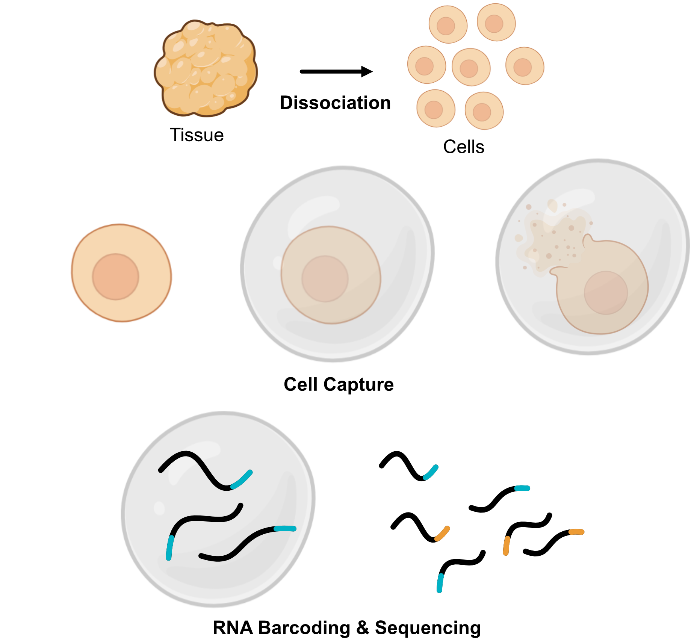{fig-align="center"}

## Challenges of Single Cell Data
- High dimensionality 
  - thousands of genes measured per cell
- Sparsity
  - many zero counts due to dropout
- Technical variation 
  - batch effects

## Batch Effects
Sources of technical variation in single-cell RNA-seq data:

- Different sequencing runs or platforms
- Samples processed at different times or days
- Different laboratories or technicians
- Different library preparation protocols
- Different cell capture methods

## Impact of Batch Effects {.smaller}
- This technical variation can lead to batch effects
  - systematic differences between batches making otherwise similar cells appear different
- Batch effects can obscure true biological signals and lead to incorrect conclusions if not properly accounted for

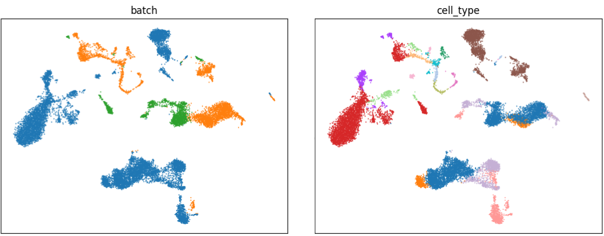{fig-align="center"}

## Impact of Batch Effects (cont.) 
- Downstream analyses affected by batch effects include:
  - Clustering 
  - Cell type identification
  - Differential expression analysis
  - Trajectory inference and pseudotime analysis
  - Integration of multiple datasets

## Batch Correction
- Batch correction methods aim to remove technical variation while preserving biological variation

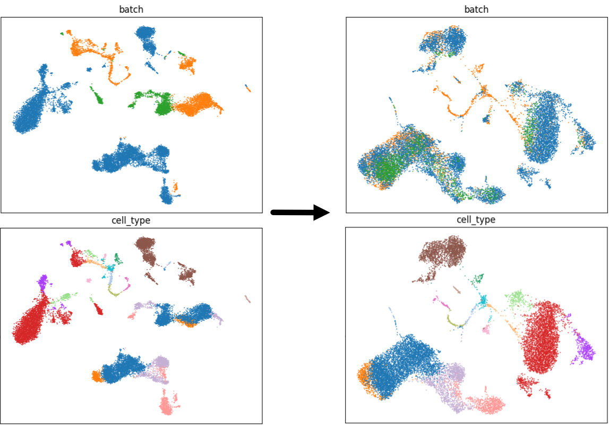{fig-align="center"}

## Challenges of Batch Correction
- Difficult to distinguish technical variation from true biological variation
- Overcorrection can remove true biological signals
- Under-correction can leave residual batch effects
- Different methods have different assumptions and may perform better or worse depending on the specific dataset and experimental design

## Tutorial
- Demonstration of batch correction and evaluation of its impact
- Dataset:
  - [Malte D Luecken, M Büttner, K Chaichoompu, A Danese, M Interlandi, M F Mueller, D C Strobl, L Zappia, M Dugas, M Colomé-Tatché, and Fabian J Theis. Benchmarking atlas-level data integration in single-cell genomics. Nature methods, December 2021. ](https://openproblems.bio/datasets/openproblems_v1/immune_cells)

## Single Cell Analysis Workflow
1. Quality control and filtering
2. Normalization
3. Feature selection
4. Dimensionality reduction

In this tutorial we will do batch correction at this stage.

## 1. Quality Control and Filtering
- Remove low-quality cells

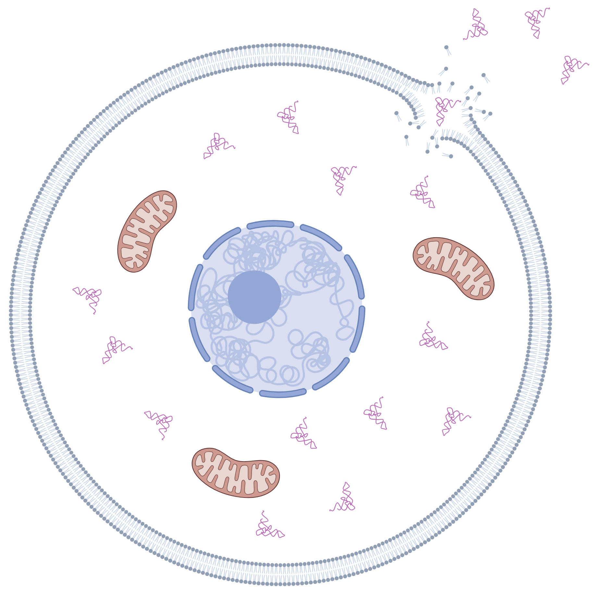{fig-align="center"}

## 2. Normalization
- Account for differences in sequencing depth and capture efficiency
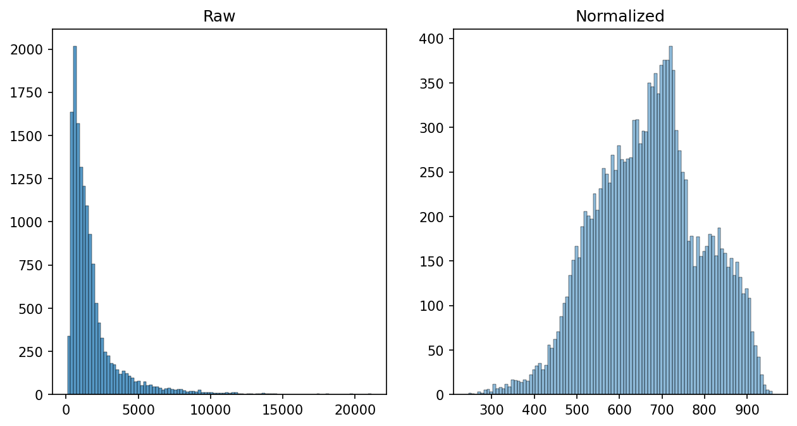{fig-align="center"}

## 3. Feature Selection
- Identify highly variable genes for downstream analysis
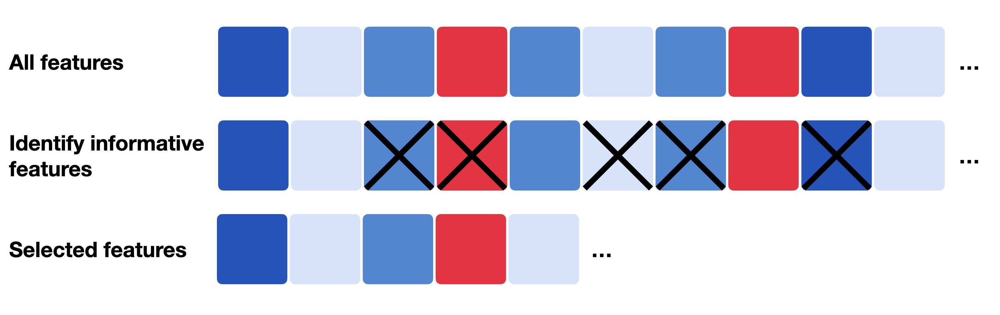{fig-align="center"}

## 4. Dimensionality Reduction
- Reduce dimensionality for visualization and clustering

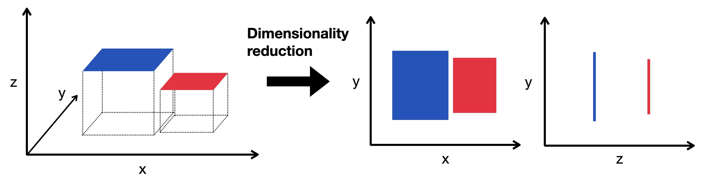{fig-align="center"}

## Dimensionality Reduction - PCA {.smaller}
- Common dimensionality reduction technique
- Starting point for further dimensionality reduction methods and other downstream tasks
- PCA creates a new set of variables called principal components (PCs)
- A PC is a weighted combination of the original genes that captures a particular pattern of correlated variation across cells

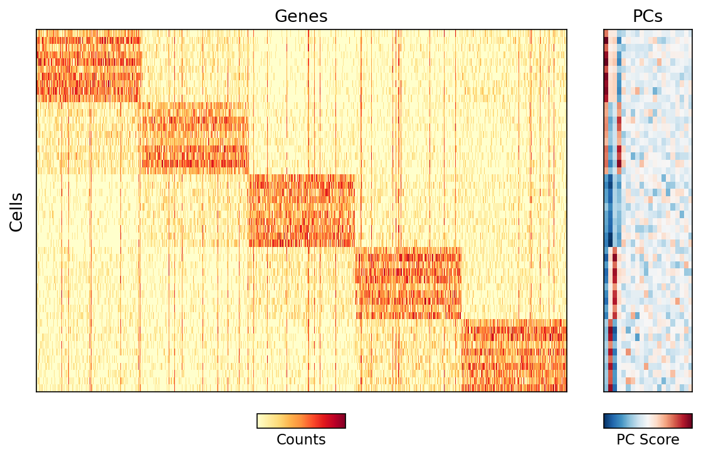{fig-align="center"}

## Batch Correction - Harmony 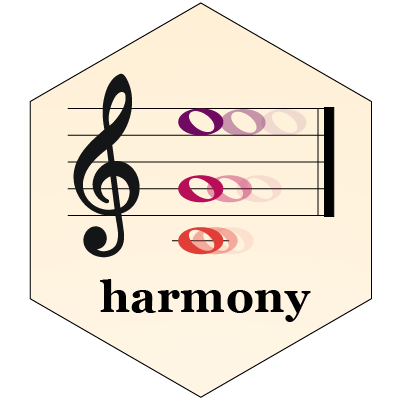
- Popular tool using an iterative algorithm to align data across batches
- Identifies shared variation across batches
- Adjusts data to remove batch effects while preserving biological variation
- Takes PC scores as input and outputs corrected PC scores for use in downstream analyses

## Batch Correction - Harmony
 
 

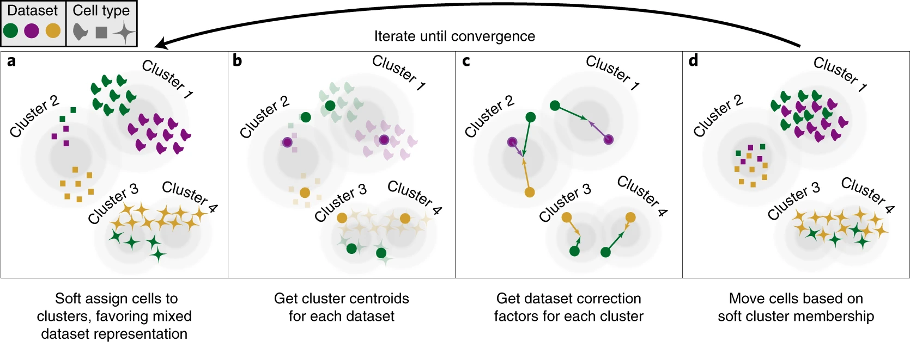{fig-align="center"}

## K-Nearest Neighbors
- Many of the analyses downstream of dimensionality reduction rely on a neighborhood graph of the cells.
- The foundation of the neighborhood graph is the K-nearest neighbors (KNN) algorithm which identifies the K closest neighbors for each cell based on a distances in the reduced dimensionality space.

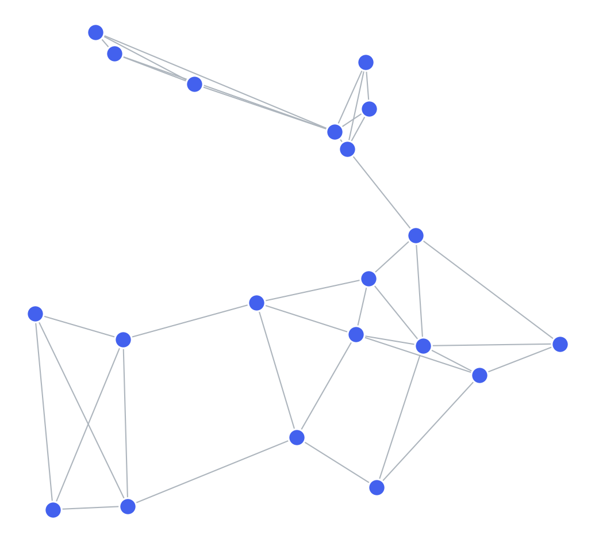{fig-align="center"}

## Evaluating Batch Correction
- One way that we can evaluate impact of batch correction is looking at the effect it has on the computed neighborhood graph.
- [Antonsson SE, Melsted P. Batch correction methods used in single-cell RNA sequencing analyses are often poorly calibrated. Genome Res. 2025](https://doi.org/10.1101/gr.279886.124)
  - Propose method to assess overcorrection

## UMAP {.smaller}
- UMAP is a popular dimensionality reduction technique for visualizing single-cell data
- We will use it to visualize the effect of batch correction on the relationship of cells to one another 
- UMAP takes the neighborhood graph as input and creates a 2D representation of the data that preserves local relationships between cells

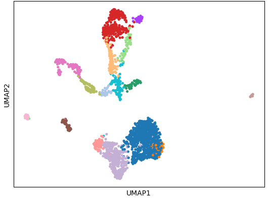{fig-align="center"}

## Tutorial

[Let's Begin!](https://mybinder.org/v2/gh/kerrycobb/interactive-demo/HEAD?urlpath=%2Fdoc%2Ftree%2Fdemo.ipynb)

[GitHub Repository](https://github.com/kerrycobb/interactive-demo)

